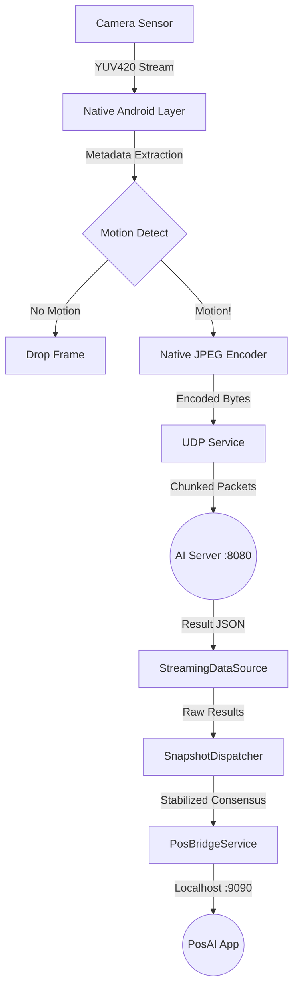

# 🏛️ ScanAI Application Architecture

> **Document Status**: Definitive Guide for ScanAI Mobile App (Worker).
> **Scope**: Internal Architecture, Data Flow, & Service Interaction.

## 1. Architectural Pattern: Service-Oriented (SOA) with Provider

ScanAI menggunakan **Service-Oriented Architecture** di mana logika bisnis dibungkus dalam service yang independen. Manajemen state dan dependency injection ditangani oleh package `Provider`.

### Core Layers
1.  **Presentation Layer** (`lib/presentation/`): UI (Camera Preview, Detection Overlay, Metrics Monitor).
2.  **Service Layer** (`lib/services/`): Orkestrasi komunikasi dan event handling (UDP, POS Bridge, Notification).
3.  **Data Layer** (`lib/data/`): Pemrosesan stream dan parsing model AI.
4.  **Core/Engine Layer** (`lib/core/`): Logika low-level (Adaptive Skipping, Smart Context Consunsus).

---

## 2. Key Modules & Components

### A. Native Vision Bridge (Kotlin)
Alih-alih memproses gambar di Dart, ScanAI memindahkan beban berat ke sisi Native Android.
*   **Compression**: Menggunakan `YuvImage.compressToJpeg` untuk encoding ultra-cepat.
*   **Luminance Extraction**: Menghitung rata-rata nilai Y (luminance) untuk deteksi gerakan tanpa perlu memproses ulang data di Flutter.

### B. High-Speed Communication (UDP)
*   **`WebSocketService`** (Implementasi UDP):
    *   Membuka socket UDP unicast ke port `8080`.
    *   **Chunking & Reassembly**: Protokol kustom untuk mengirim data besar (>MTU) melalui UDP dengan menjamin urutan data saat disusun kembali.
    *   **Multi-tenant Ready**: Setiap paket menyertakan `sessionId` dan `token` untuk keamanan.
*   **`PosBridgeService`** (`lib/services/pos_bridge_service.dart`):
    *   Berjalan sebagai Local WebSocket Server pada port `9090` (Localhost).
    *   Menyebarkan hasil deteksi yang sudah stabil ke sistem POS.

### C. Intelligence & Stabilization
*   **`StreamingDataSource`**:
    *   Mengatur alur streaming: Motion Check -> Adaptive Skip -> Encode Request -> Transmit.
*   **`SnapshotDispatcher`** (Smart Context Windows):
    *   Menerapkan **Majority Voting** pada jendela waktu 200ms untuk menghilangkan noise deteksi.
    *   Memastikan angka yang muncul di kasir tidak melompat-lompat akibat oklusi sementara atau glitch model.

---

## 3. Data Flow Pipeline (UDP Edition)

Alur data dari sensor kamera hingga layar kasir:



---

## 4. Performance & Reliability

### Adaptive Frame Skipping
Logic di `lib/core/logic/adaptive_frame_skipper.dart`:
*   **Congestion Control**: Menghitung jumlah frame "in-flight" yang belum di-ACK oleh server.
*   **Throttling**: Jika buffer atau latency naik, interval pengiriman frame otomatis dikurangi untuk menjaga stabilitas sistem secara keseluruhan.

### Google Play Integrity
*   **Demo Mode & Review Mode**: Toggles di `AppConstants` yang memungkinkan aplikasi berjalan mandiri (mock data) untuk memudahkan proses review oleh tim Google Play.
*   **Graceful Degradation**: Arsitektur yang memungkinkan UI tetap responsif meskipun koneksi hardware terputus.

---

## 5. Directory Structure Map

```
lib/
├── core/
│   ├── logic/          # Brains: Skipping, Dispatcher, Stabilizer
│   ├── constants/      # App settings & API configs
│   └── performance/    # Battery & memory managers
├── data/
│   ├── datasources/    # Streaming & AI connectors
│   └── models/         # Server response parsers
├── services/
│   ├── websocket_service.dart # UDP Proto Implementation
│   ├── pos_bridge_service.dart # Local Bridge (Server)
│   └── camera_service.dart    # Camera & Native Bridge
└── presentation/       # UI Pages & Custom Widgets
```
