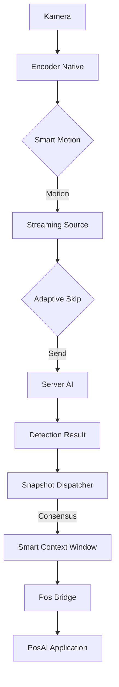
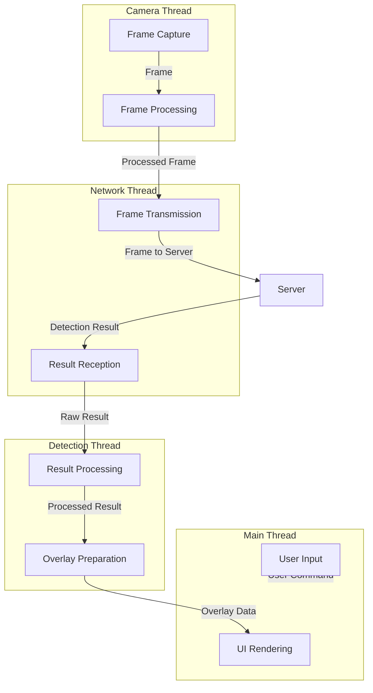
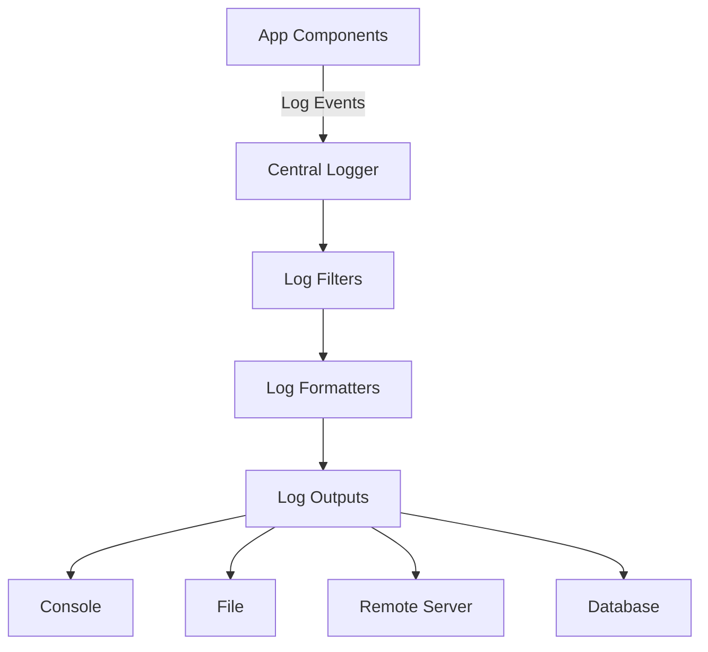
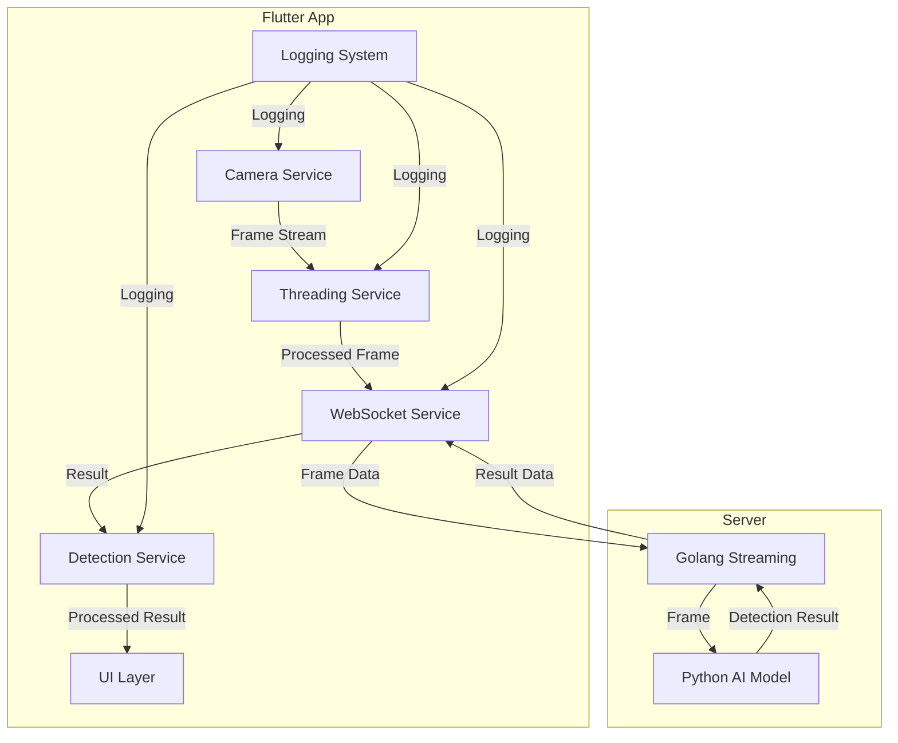
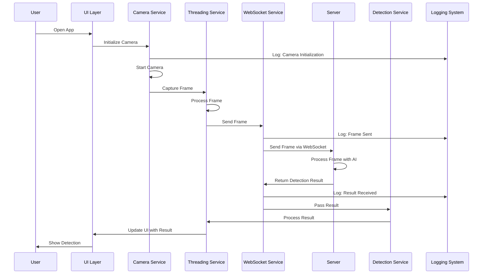
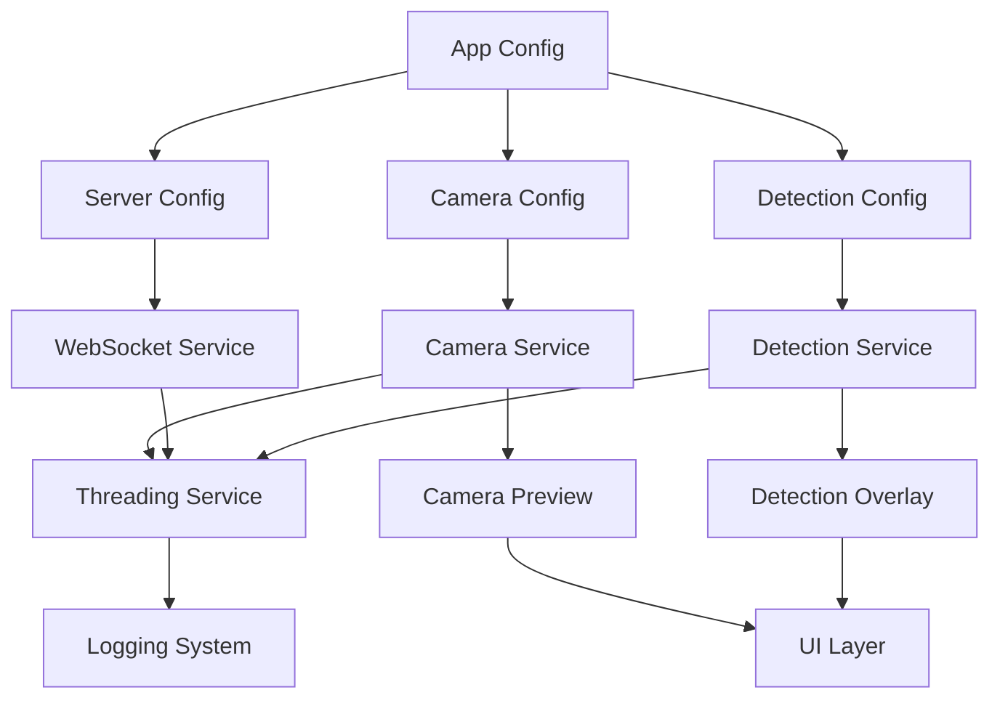

# Arsitektur Aplikasi Deteksi Objek Realtime dengan Flutter

## 1. Analisis Kebutuhan

### 1.1. Konteks Proyek
- Aplikasi Flutter untuk deteksi objek realtime
- Streaming video ke server cloud (kemungkinan Google Cloud)
- Server menggunakan Python untuk AI dan Golang untuk streaming
- Server mengembalikan data hasil deteksi (drawing bbox) saja untuk mengurangi bandwidth
- Aplikasi perlu modular dengan konfigurasi terpusat
- Perlu threading yang baik untuk sinkronisasi tampilan kamera dan drawing
- Sistem logging yang kuat untuk debugging

### 1.2. Tujuan
1. Rancang arsitektur aplikasi Flutter yang modular dan scalable
2. Definisikan struktur folder yang jelas dan tidak ambigu
3. Rancang alur data dari kamera ke server dan kembali ke aplikasi
4. Identifikasi komponen-komponen utama yang dibutuhkan
5. Rancang mekanisme threading untuk menghindari race condition
6. Rencanakan sistem logging yang komprehensif

## 2. Arsitektur Tingkat Tinggi

### 2.1. Layer Arsitektur
```
┌─────────────────────────────────────────────────────────────┐
│                    Presentation Layer                       │
│  ┌─────────────┐  ┌──────────────┐  ┌───────────────────┐  │
│  │  UI Pages   │  │   Widgets    │  │ State Management │  │
│  └─────────────┘  └──────────────┘  └───────────────────┘  │
└─────────────────────────────────────────────────────────────┘
                              │
┌─────────────────────────────────────────────────────────────┐
│                   Business Logic Layer                     │
│  ┌─────────────┐  ┌──────────────┐  ┌───────────────────┐  │
│  │  Use Cases  │  │  Entities    │  │   Services       │  │
│  └─────────────┘  └──────────────┘  └───────────────────┘  │
└─────────────────────────────────────────────────────────────┘
                              │
┌─────────────────────────────────────────────────────────────┐
│                      Data Layer                            │
│  ┌─────────────┐  ┌──────────────┐  ┌───────────────────┐  │
│  │  Models     │  │ Repositories │  │  Data Sources     │  │
│  └─────────────┘  └──────────────┘  └───────────────────┘  │
└─────────────────────────────────────────────────────────────┘
                              │
┌─────────────────────────────────────────────────────────────┐
│                      Core Layer                            │
│  ┌─────────────┐  ┌──────────────┐  ┌───────────────────┐  │
│  │  Utilities  │  │  Constants   │  │     Logging       │  │
│  └─────────────┘  └──────────────┘  └───────────────────┘  │
└─────────────────────────────────────────────────────────────┘
```

### 2.2. Komponen Utama
- **Camera Service**: Mengelola akses kamera via Native Bridge (Kotlin), streaming metadata, dan penanganan frame.
- **UDP Service**: Mengelola pengiriman frame via Binary UDP Protocol dengan mekanisme chunking & reassembly.
- **Smart Motion Detector**: Filter berbasis metadata `meanY` dari Native yang menganalisis perubahan pencahayaan untuk menghemat bandwidth.
- **Native Vision Bridge**: Modul di sisi Android (Kotlin) untuk hardware-accelerated JPEG encoding dan ekstraksi metadata.
- **Snapshot Dispatcher**: Engine **Smart Context Windows** yang menggunakan Majority Voting (200ms window) untuk menstabilkan deteksi.
- **Pos Bridge Service**: Local WebSocket Server (Port 9090) untuk menyiarkan hasil final ke aplikasi PosAI.
- **Configuration Manager**: Mengelola konfigurasi aplikasi secara terpusat (AppConstants), termasuk Review Mode untuk Google Play.

## 3. Struktur Folder

```
lib/
├── config/                    # Konfigurasi aplikasi
├── core/                      # Core functionality dan utilities
│   ├── constants/             # Konstanta aplikasi (Single Source of Truth)
│   ├── logic/                 # Logika bisnis kritis (SnapshotDispatcher)
│   ├── utils/                 # Utility functions (Logger)
│   └── performance/           # Performance monitoring
├── data/                      # Data layer
│   ├── models/                # Data models
│   ├── datasources/           # Data sources (StreamingDataSource)
│   └── repositories/          # Repositories
├── presentation/              # Presentation layer (UI & State)
├── services/                  # Services (WebSocket, Bridge, Encoder)
└── main.dart                 # Entry point
```

## 4. Alur Data

### 4.1. Alur Data Deteksi Realtime



### 4.2. Detail Alur Data
1. **Inisialisasi Kamera**:
   - Aplikasi meminta izin akses kamera
   - Camera Service menginisialisasi kamera
   - Menggunakan resolusi optimal (640x360) untuk performa realtime

2. **Pengambilan & Encoding Frame**:
   - Kamera menghasilkan frame YUV420.
   - **Native Video Encoder** (via Platform Channel) mengkonversi YUV langsung ke JPEG dalam 5-10ms (Hardware Accelerated).
   - Menghindari konversi YUV->RGB->JPEG di Dart yang lambat (300ms+).

3. **Smart Motion Detection (Native-Assisted)**:
   - Frame tidak langsung dikirim. Kotlin mengekstrak nilai **meanY** (rata-rata luminance).
   - **StreamingDatasource** membandingkan delta `meanY` saat ini dengan frame terakhir.
   - Jika delta < `AppConstants.motionSensitivityThreshold`, frame **DI-SKIP**.
   - Hemat bandwidth drastis karena encoding JPEG hanya dilakukan jika ada gerakan.
   - Mekanisme **Keep-Alive** memaksa pengiriman 1 frame tiap 2 detik untuk maintenance koneksi.

4. **Pengiriman ke Server (Binary UDP)**:
   - Jika lolos motion detection, frame dikirim menggunakan **Binary UDP Protocol**.
   - Format biner kustom untuk meminimalisir overhead.
   - Protokol: `[TokenLen][Token][SessionIDLen][SessionID][SeqNum][Width][Height][FormatLen][Format][PixelData]`.
   - Menggunakan chunking untuk paket yang melebihi MTU jaringan.

5. **Proses Deteksi di Server**:
   - Server menerima paket UDP, merakit ulang, dan mengirim ke Python AI.
   - Hasil deteksi dikembalikan via WebSocket/TCP (karena data teks kecil dan butuh reliabilitas).

6. **Buffered Display Sync (Zero Latency Perception)**:
   - Aplikasi tidak menampilkan "Live Preview" kamera mentah.
   - Aplikasi menyimpan frame yang dikirim di **Frame Buffer** lokal.
   - Saat menerima hasil deteksi (misal untuk Frame ID #100), aplikasi mengambil Frame #100 dari buffer.
   - Frame #100 dan Kotak Deteksi #100 ditampilkan bersamaan.
   - Hasil: Gerakan objek dan kotak deteksi selalu sinkron sempurna, tidak ada efek "ghosting" atau kotak tertinggal.

## 5. Komponen-Komponen Utama

### 5.1. Camera Service
- **Tanggung Jawab**: Mengelola akses kamera, konfigurasi kamera, dan streaming frame
- **Fitur**:
  - Inisialisasi kamera dengan konfigurasi yang dapat disesuaikan
  - Mengelola permission kamera
  - Mengambil frame dari kamera dan menyediakannya sebagai stream
  - Konversi format frame (YUV ke RGB/JPEG)
  - Manajemen siklus hidup kamera (pause/resume/release)

### 5.2. UDP/WebSocket Service
- **Tanggung Jawab**: Mengelola komunikasi real-time dengan server via UDP
- **Fitur**:
  - Implementasi UDP Unicast dengan chunking & reassembly.
  - Heartbeat mechanism untuk menjaga lubang firewall (NAT).
  - Handle reconnection otomatis dan backoff strategy.
  - Multi-user safety menggunakan SessionID unik per aplikasi.

### 5.3. Detection Service
- **Tanggung Jawab**: Mengelola proses deteksi dan rendering hasil
- **Fitur**:
  - Mengkoordinasikan alur data antara kamera dan server
  - Memproses hasil deteksi dari server
  - Mengelola state deteksi (mulai/berhenti/pause)
  - Menyediakan callback untuk update UI

### 5.4. Configuration Manager
- **Tanggung Jawab**: Mengelola konfigurasi aplikasi secara terpusat
- **Fitur**:
  - Manajemen konfigurasi kamera (resolusi, fps, dll.)
  - Konfigurasi server (URL, port, endpoint)
  - Konfigurasi deteksi (confidence threshold, max objects, dll.)
  - Loading dan saving konfigurasi dari/ke local storage
  - Validasi konfigurasi

### 5.5. Threading Service
- **Tanggung Jawab**: Mengelola threading untuk sinkronisasi tampilan kamera dan drawing
- **Fitur**:
  - Manajemen thread untuk proses yang berat (konversi gambar, pengiriman data)
  - Sinkronisasi antara thread UI dan thread background
  - Antrian tugas (task queue) untuk proses asynchronous
  - Prevention dari race condition dengan mekanisme locking
  - Prioritas tugas berdasarkan urgensi

### 5.6. Logging System
- **Tanggung Jawab**: Sistem logging komprehensif untuk debugging
- **Fitur**:
  - Logging dengan berbagai level (debug, info, warning, error)
  - Logging untuk performa metrics (latency, frame rate, memory usage)
  - Logging untuk network activity
  - Export log untuk analisis
  - Filterable log berdasarkan kategori

### 5.7. Detection Overlay
- **Tanggung Jawab**: Menampilkan hasil deteksi pada UI
- **Fitur**:
  - Drawing bounding box pada tampilan kamera
  - Customizable appearance (color, thickness, label)
  - Smooth animation untuk perubahan posisi bounding box
  - Handle multiple objects detection
  - Performance optimization untuk rendering

### 5.8. Camera Preview
- **Tanggung Jawab**: Menampilkan preview kamera
- **Fitur**:
  - Menampilkan stream kamera real-time
  - Handle orientation changes
  - Zoom control
  - Focus control
  - Performance optimization untuk rendering

## 6. Mekanisme Threading

### 6.1. Arsitektur Threading


### 6.2. Isolate Strategy
- Flutter menggunakan Isolate untuk concurrent programming, bukan threads
- Setiap Isolate memiliki memory space sendiri, sehingga menghindari race condition
- Komunikasi antar Isolate dilakukan melalui message passing

### 6.3. Message Passing Protocol
```dart
class TaskMessage {
  final String taskId;
  final TaskType type;
  final dynamic data;
  final SendPort replyPort;
}

class ResultMessage {
  final String taskId;
  final bool success;
  final dynamic data;
  final String? error;
}

enum TaskType {
  imageProcessing,
  networkRequest,
  detectionProcessing,
}
```

### 6.4. Synchronization Mechanisms
- **Mutex Lock**: Untuk melindungi shared resources
- **Semaphore**: Untuk mengontrol akses ke resource terbatas
- **Condition Variable**: Untuk menunggu kondisi tertentu
- **Atomic Operations**: Untuk operasi yang harus atomic

### 6.5. Frame Processing Pipeline
1. **Stage 1 - Capture**: Camera thread mengambil frame
2. **Stage 2 - Preprocessing**: Image processing isolate melakukan konversi format
3. **Stage 3 - Transmission**: Network isolate mengirim frame ke server
4. **Stage 4 - Reception**: Network isolate menerima hasil deteksi
5. **Stage 5 - Postprocessing**: Detection isolate memproses hasil
6. **Stage 6 - Rendering**: Main thread menampilkan hasil

### 6.6. Race Condition Prevention
- **Immutable Data**: Menggunakan data immutable saat passing antar threads
- **Thread-safe Collections**: Menggunakan collections yang thread-safe
- **Synchronized Access**: Menggunakan lock untuk akses ke shared resources
- **Copy-on-Write**: Membuat copy data sebelum modifikasi
- **Event-driven Design**: Menggunakan event loop untuk menghindari blocking

## 7. Sistem Logging

### 7.1. Arsitektur Logging


### 7.2. Logger Implementation
```dart
class AppLogger {
  // Singleton instance
  static final AppLogger _instance = AppLogger._internal();
  factory AppLogger() => _instance;
  AppLogger._internal();
  
  // Log level
  LogLevel _logLevel = LogLevel.info;
  
  // Log outputs
  final List<LogOutput> _outputs = [];
  
  // Log formatters
  LogFormatter _formatter = DefaultLogFormatter();
  
  // Log filters
  final List<LogFilter> _filters = [];
}

enum LogLevel {
  debug(0),
  info(1),
  warning(2),
  error(3),
  fatal(4);
  
  final int value;
  const LogLevel(this.value);
}
```

### 7.3. Log Categories
- **Camera**: Log terkait operasi kamera (inisialisasi, frame capture, error)
- **Network**: Log terkait komunikasi jaringan (koneksi, pengiriman, penerimaan)
- **Detection**: Log terkait proses deteksi (pemrosesan, hasil, error)
- **Threading**: Log terkait operasi threading (task, synchronization, error)
- **Performance**: Log terkait performa (latency, frame rate, memory usage)
- **UI**: Log terkait operasi UI (rendering, interaction, error)

### 7.4. Log Output Strategies
- **Console Output**: Menampilkan log di console untuk development
- **File Output**: Menyimpan log ke file untuk analisis offline
- **Remote Output**: Mengirim log ke server untuk monitoring remote
- **Database Output**: Menyimpan log ke database lokal untuk querying
- **Crash Reporting**: Mengirim log fatal ke crash reporting service

### 7.5. Log Formatting
- **Structured Format**: Menggunakan format terstruktur (JSON) untuk parsing mudah
- **Human-readable Format**: Format yang mudah dibaca untuk development
- **Machine-readable Format**: Format yang mudah diproses oleh tools
- **Customizable Fields**: Field yang dapat disesuaikan berdasarkan kebutuhan

### 7.6. Performance Logging
- **Frame Rate Logging**: Mencatat frame rate kamera dan rendering
- **Latency Logging**: Mencatat latency dari capture ke detection result
- **Memory Usage Logging**: Mencatat penggunaan memory
- **CPU Usage Logging**: Mencatat penggunaan CPU
- **Network Metrics Logging**: Mencatat bandwidth, packet loss, dll.

### 7.7. Error Logging
- **Exception Logging**: Mencatat exception dengan stack trace
- **Error Context**: Menyertakan konteks saat error terjadi
- **Error Aggregation**: Mengelompokkan error yang serupa
- **Error Reporting**: Mengirim error ke server untuk analisis

## 8. Diagram Alur Data

### 8.1. Diagram Arsitektur Tingkat Tinggi


### 8.2. Diagram Alur Data Detail


### 8.3. Diagram Komponen dan Dependensi


## 9. Kesimpulan

Arsitektur yang dirancang untuk aplikasi deteksi objek realtime dengan Flutter telah mempertimbangkan aspek-aspek penting seperti:

1. **Modularitas**: Arsitektur dirancang dengan pendekatan modular yang memungkinkan pengembangan, pengujian, dan pemeliharaan yang mudah.
2. **Scalability**: Struktur yang dirancang dapat mendukung penambahan fitur baru tanpa mengubah arsitektur yang ada.
3. **Performa**: Mekanisme threading yang optimal dan alur data yang efisien untuk memastikan performa realtime.
4. **Maintainability**: Struktur folder yang jelas dan pemisahan tanggung jawab yang jelas antar komponen.
5. **Debugging**: Sistem logging yang komprehensif untuk memudahkan identifikasi dan resolusi masalah.

Dengan arsitektur ini, aplikasi deteksi objek realtime dapat dikembangkan dengan lebih terstruktur, terukur, dan mudah dipelihara.